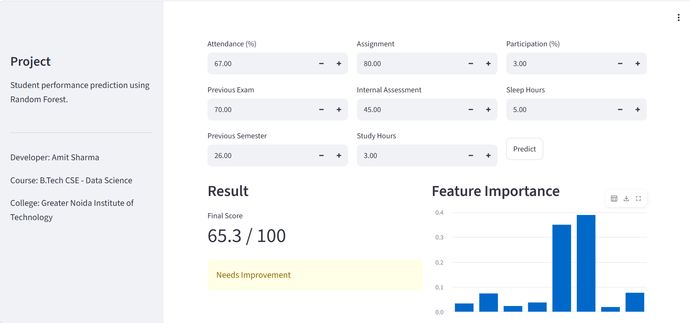
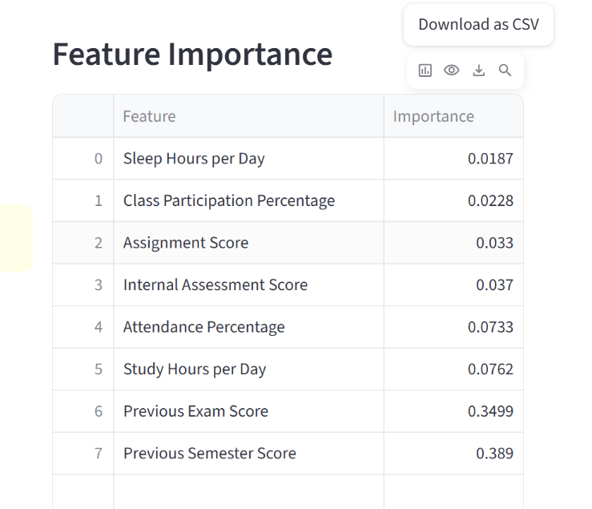

# Student Performance Predictor

An ML-based student performance prediction system that predicts a student's final exam score using academic and behavioral factors.

## Demo

### Application Screenshots

#### Input Interface

#### Prediction Result

#### Feature Importance

### Video Demo

