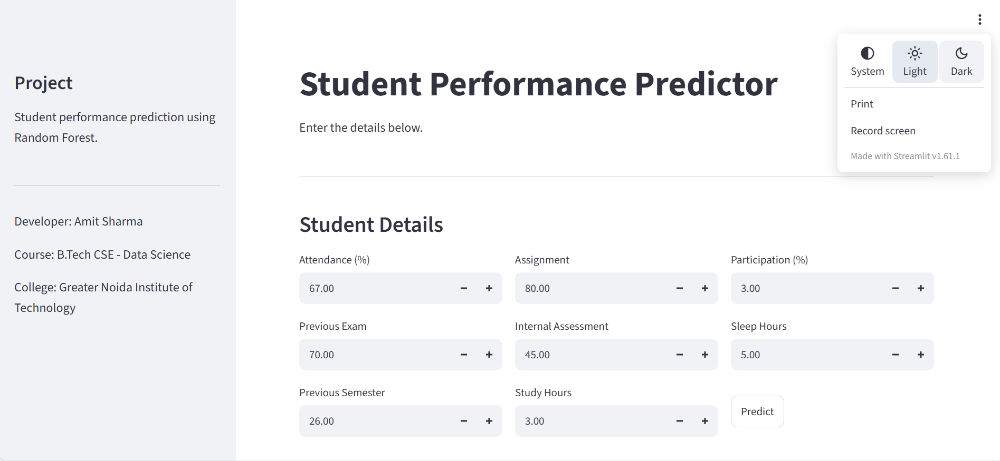

# Student Performance Predictor

An ML-based student performance prediction system that predicts a student's final exam score using academic and behavioral factors.

## Demo

### Application Screenshots

#### Input Interface


#### Prediction Result


#### Feature Importance


## Features

- Predicts final exam score using student academic and behavioral data
- Uses Random Forest Regression
- Interactive Streamlit web interface
- Displays predicted score
- Shows performance category
- Displays feature importance
- Uses a trained model saved with Joblib
- Public demo using Cloudflare Tunnel

## Technologies Used

- Python
- Pandas
- NumPy
- Scikit-learn
- Matplotlib
- Seaborn
- Joblib
- Streamlit
- Cloudflare Tunnel

## Dataset

The project uses a synthetic dataset containing 3,000 student records.

The dataset includes academic and behavioral factors such as:

- Attendance
- Previous exam score
- Previous semester score
- Assignment score
- Internal assessment
- Study hours
- Class participation
- Sleep hours

## Machine Learning Model

The project uses a Random Forest Regression model to predict the final exam score.

The model uses the following input features:

- Attendance Percentage
- Previous Exam Score
- Previous Semester Score
- Assignment Score
- Internal Assessment Score
- Study Hours per Day
- Class Participation Percentage
- Sleep Hours per Day

The dataset is divided into training and testing sets using an 80:20 split.

The Random Forest model is trained with 50 decision trees and evaluated using the R² score.

## Model Performance

The model was evaluated using the R² (R-squared) score on the test dataset.

**R² Score:** 91.26%

## How It Works

1. Student data is generated and prepared for training.
2. The dataset is divided into training and testing data.
3. A Random Forest Regression model is trained on the training data.
4. The model is evaluated using the R² score.
5. The trained model is saved using Joblib.
6. Streamlit loads the saved model and takes student details as input.
7. The model predicts the final exam score.
8. Feature importance is displayed to provide insight into the model.

## Project Structure

```text
student-performance-predictor/
│
├── demo/
│   ├── Demo_Home.png
│   ├── Demo_Result_page.png
│   └── feature_importance.png
│
├── AI_driven_student_performance_prediction_system.ipynb
├── README.md
├── app.py
├── requirements.txt
├── student_data.csv
└── student_performance_model.pkl

## **Download**

To download the project, click the **Code** button on your GitHub repository and select **Download ZIP**, then extract the folder.

---

## **Installation**

Clone the repository:

bash
git clone 
cd student-performance-predictor

Install the required Python libraries by running:

Bash
pip install -r requirements.txt

How to Run
Run the Streamlit application:

Bash
streamlit run app.py

#**Future Improvements**

-> Add more student performance factors

-> Support prediction for multiple students

-> Add performance history and comparison

-> Add more machine learning models

-> Improve prediction recommendations

-> Deploy the application permanently

#**Author**
Amit Sharma
B.Tech Computer Science & Engineering with specialization in Data science
Greater Noida Institute of Technology


